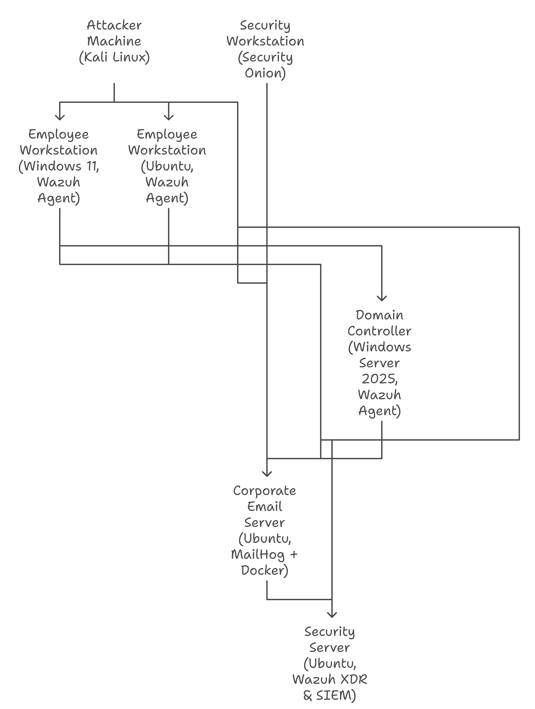

# Virtual Home Cybersecurity Lab

## Overview
This project simulates a small-to-medium business (SMB) network environment, combining both **offensive** and **defensive** cybersecurity tools. The lab provides hands-on experience in:

- System administration  
- Endpoint security  
- Intrusion detection  
- Log analysis  
- Incident response  
- Penetration testing  

By creating a controlled environment, I can practice defending against real-world attacks while exploring offensive tradecraft.

---

## Architecture / Topology
The lab environment consists of **servers, workstations, and security tools** deployed across virtual machines. It mimics a corporate infrastructure where employees, IT assets, and attackers interact in the same network.

### Network Components

**Workstations**
- Employee Workstation (Windows 11 Enterprise, Wazuh Agent): Represents a typical employee workstation running Windows 11 Enterprise. The Wazuh agent is installed to monitor the workstation for security threats and send logs to the Wazuh server.
- Employee Workstation (Ubuntu Desktop, Wazuh Agent): Represents another typical employee workstation, but this one runs Ubuntu Desktop. It also has the Wazuh agent installed for security monitoring.
- Security Workstation (Security Onion): A dedicated workstation running Security Onion, a network security monitoring distribution. This workstation is used for analyzing network traffic and security alerts.
- Attacker Machine (Kali Linux): A machine running Kali Linux, a penetration testing distribution. This machine is used to simulate attacks against the network to test the effectiveness of the security measures.

**Servers**
- Domain Controller / Active Directory (Windows Server 2025, Wazuh Agent): A server running Windows Server 2025 and acting as the domain controller for the network. It manages user authentication and authorization. The Wazuh agent is installed to monitor the server for security threats.
- Corporate Email Server (Ubuntu Desktop with MailHog + Docker): A server running Ubuntu Desktop and hosting the corporate email server. MailHog is used for testing email functionality, and Docker is used to containerize the email server components.
- Security Server (Ubuntu Server with Wazuh XDR & SIEM): A server running Ubuntu Server and hosting the Wazuh XDR & SIEM platform. This server collects and analyzes security logs from all the other components in the network. 
—
## Interconnections
- Employee Workstations to Domain Controller: Employee workstations authenticate against the Domain Controller for access to network resources.
- Employee Workstations to Email Server: Employee workstations access the Corporate Email Server for sending and receiving emails.
- Employee Workstations to Security Server: Employee workstations send security logs to the Security Server via the Wazuh agent.
- Security Workstation to Domain Controller, Email Server, Security Server: The Security Workstation monitors network traffic to and from these servers.
- Domain Controller to Email Server: The Domain Controller may be used for user authentication by the Email Server.
- Domain Controller to Security Server: The Domain Controller sends security logs to the Security Server via the Wazuh agent.
- Email Server to Security Server: The Email Server sends security logs to the Security Server.
- Attacker Machine to all other components: The Attacker Machine can attempt to connect to and exploit vulnerabilities in all other components.
---

## Environment & Tools

### Host System
- **OS**: Windows 11  
- **CPU**: Intel i7 (10 Cores)  
- **RAM**: 16 GB  
- **Hypervisor**: VirtualBox  
- **Storage**: 1TB external hard drive (VM storage)  

### Defensive Tools
- **Microsoft Active Directory** – User and resource management.  
- **Wazuh** – Open-source SIEM/XDR for log analysis, vulnerability management, and intrusion detection.  
- **MailHog** – Lightweight fake SMTP server for testing enterprise mail flow.  
- **Security Onion** – Network security monitoring and log analysis (Elastic Stack).  

### Offensive Tools
- **Evil-WinRM** – Post-exploitation WinRM client.  
- **Hydra** – Brute-force tool for testing authentication.  
- **SecLists** – Penetration testing wordlists.  
- **NetExec** – Lateral movement and remote execution across multiple protocols.  
- **XFreeRDP** – Open-source RDP client for post-exploitation access.  

---

## Lab Setup & Configuration
This section currently provides a **high-level summary** of the lab setup. In the future, it will be expanded into a full guide that includes:

- **Installation instructions** (for each OS and tool)  
- **VM configurations** (CPU, memory, storage, networking)  
- **System requirements**  
- **Step-by-step walkthroughs** with commands and screenshots  
- **Troubleshooting tips & common issues**  

### Current Setup Summary
1. Install **VirtualBox** on Windows 11.  
2. Provision VMs on the external drive for storage and performance.  
3. Configure a private NAT/Host-only network to simulate a corporate LAN.  
4. Install and configure components:
   - **Windows Server 2025**: Promote to Domain Controller + Active Directory.  
   - **Windows 11 Enterprise**: Join domain, install Wazuh Agent.  
   - **Ubuntu Desktop**: Install Wazuh Agent, set up Docker + MailHog.  
   - **Ubuntu Server**: Deploy Wazuh SIEM/XDR.  
   - **Security Onion**: Configure sensors + Elastic Stack.  
   - **Kali Linux**: Install Hydra, Evil-WinRM, SecLists, NetExec, XFreeRDP.  
5. Integrate log forwarding to **Wazuh** and monitoring in **Security Onion**.  
6. Validate the lab by simulating attacks and verifying detections.  

---

## Use Cases & Skills Learned

This virtual lab is designed to support multiple cybersecurity objectives and hands-on learning opportunities:

### Use Cases
- **Security Monitoring** – Provides visibility into the network architecture for detecting suspicious activity.  
- **Attack Simulation** – Enables simulated attacks to test and improve defensive measures.  
- **Training** – Serves as a safe environment for practicing monitoring and incident response workflows.  
- **Vulnerability Assessment** – Helps identify and evaluate potential weaknesses across systems.  
- **Incident Response** – Supports response practice by providing a clear understanding of network topology and log flow.  

### Blue Team Skills
- Active Directory administration and domain hardening.  
- Deploying and managing Wazuh SIEM/XDR.  
- Email server simulation and monitoring with MailHog.  
- Log correlation, alert triage, and network traffic analysis using Security Onion.  

### Red Team Skills
- Brute-force and authentication testing with Hydra.  
- Lateral movement and privilege escalation via NetExec & Evil-WinRM.  
- Reconnaissance and exploitation with SecLists and RDP (XFreeRDP).  

### Purple Team Skills
- Mapping red team techniques to blue team detections (MITRE ATT&CK alignment).  
- Validating SIEM rules and detection capabilities using simulated attacks.  
- Improving log sources and monitoring based on red team findings.  
- Building a feedback loop between attack simulations and defensive playbooks.  

---

## Future Improvements
- Add **pfSense/OPNsense** for firewall + perimeter defense.  
- Expand with **Splunk** for SIEM comparison.  
- Deploy **honeypots** for threat emulation.  
- Automate deployment using **Ansible** or **Terraform**.  
---

## References
- [Wazuh Documentation](https://documentation.wazuh.com/)  
- [Security Onion Docs](https://securityonion.net/docs/)  
- [MailHog GitHub](https://github.com/mailhog/MailHog)  
- [Kali Linux Tools](https://www.kali.org/tools/)  
- [SecLists GitHub](https://github.com/danielmiessler/SecLists)  

